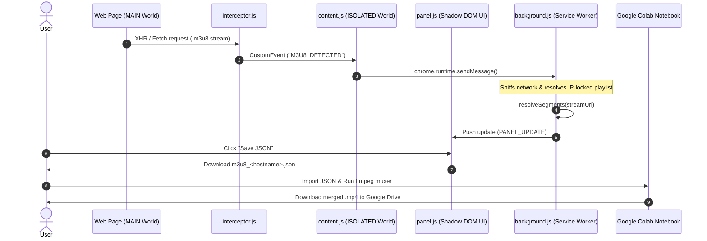

# Architecture Overview — M3U8 Detector

This document details the architectural design, component interactions, security model, and data flow of **M3U8 Detector**.

---

## 📐 High-Level Architecture Diagram



---

## 🧩 Core Components

### 1. Main World Interceptor (`interceptor.js`)
- **Execution Context**: Host Page `MAIN` World.
- **Responsibility**: Wraps `window.XMLHttpRequest` and `window.fetch` to intercept HLS playlist URLs (`.m3u8`, `.m3u`) and video segments loaded dynamically by embedded video players (e.g., HLS.js, Video.js, JWPlayer).
- **Communication**: Uses DOM `CustomEvent` (`M3U8_DETECTED`) to safely cross the boundary into the extension's Isolated World.

### 2. Isolated Content Script (`content.js`)
- **Execution Context**: Chrome Extension `ISOLATED` World.
- **Responsibility**: Acts as a bridge between `interceptor.js` and `background.js`. Listens for `M3U8_DETECTED` events and forwards payload data via `chrome.runtime.sendMessage`.

### 3. Background Service Worker (`background.js`)
- **Execution Context**: Manifest V3 Service Worker.
- **Responsibilities**:
  - Monitors network traffic via `chrome.webRequest.onBeforeRequest` as a fallback network sniffer.
  - Stores tab-specific detected streams in `detected[tabId]`.
  - Executes `resolveSegments(url)` to fetch playlists using the client's local IP and origin headers.
  - Syncs pinned streams using `chrome.storage.local`.
  - Broadcasts stream state changes (`PANEL_UPDATE`) to active tab panels.

### 4. Floating Overlay Panel (`panel.js`)
- **Execution Context**: Host Page (Injected Script).
- **Responsibility**: Renders an interactive sidebar panel containing detected stream URLs, segment counts, cookies, and export controls.
- **Encapsulation**: Built entirely inside a **Shadow DOM** (`#m3u8-detector-root`) to ensure CSS isolation from host web applications.

### 5. Options & Colab Delivery (`options.html` / `options.js`)
- **Execution Context**: Extension Extension Page.
- **Responsibility**: Displays step-by-step workflow instructions and delivers the embedded Google Colab Notebook (`hls-colab.ipynb`) dynamically for downloading.

---

## 🔑 Key Technical Mechanisms

### 1. IP-Lock Bypass Strategy
1. **The Problem**: Media servers (e.g., `morencius.com`) often sign HLS playlist URLs with short-lived tokens locked to the user's IP address (`ip_cidr`). Requesting the playlist directly from cloud providers like Google Colab results in HTTP `403 Forbidden` errors.
2. **The Solution**: The Chrome Service Worker (`background.js`) fetches the `.m3u8` master playlist using the user's browser session (same IP and cookies). It extracts the individual segment URLs (`.ts` / CDN chunks).
3. **Outcome**: The CDN segment URLs are exported in the JSON file. CDN segment endpoints are time-limited but **not IP-locked**, allowing Google Colab to download all segments directly at high speed.

### 2. Disguised Segment Muxing (PNG Header Stripping)
- Certain video CDNs (e.g., TikTok CDN) prepend a 1x1 PNG image header (`\x89PNG\r\n\x1a\n`) to video segment chunks (`.image` or `.ts`) to obscure video traffic.
- The companion Python notebook in Google Colab detects the `\x89PNG` magic bytes, strips the fake image wrapper up to the `IEND` chunk, and feeds pure MPEG-TS bytes directly into `ffmpeg` for lossy/lossless `.mp4` muxing.

---

## 📂 File Directory Map

```text
m3u8-detector/
├── manifest.json          # Chrome Extension Manifest V3 + Firefox gecko settings
├── icons/                 # Extension toolbar & store icons (16/32/48/128/512 px)
├── src/
│   ├── background.js      # Service worker: request interception, segment resolution, pin storage
│   ├── content.js         # Content script bridge between MAIN & ISOLATED worlds
│   ├── interceptor.js     # Page-level XHR/fetch hook (injected into MAIN world)
│   ├── panel.js           # Shadow DOM sidebar panel UI (theme-aware)
│   ├── options.html       # Options page: pinned streams, notebook/script download, help
│   ├── options.js         # Options logic: storage reader, notebook/script downloader
│   ├── notebooks/
│   │   └── hls-colab.ipynb  # Google Colab notebook: HLS + direct MP4 → Google Drive
│   └── scripts/
│       └── hls-local.sh     # Local bash script: HLS + direct MP4 → ~/Downloads
├── tests/                 # (reserved for automated tests)
├── dist/                  # (reserved for release ZIPs)
├── README.md              # Project overview & usage guide
├── CHANGELOG.md           # Version history and release notes
├── CONTRIBUTING.md        # Contribution guidelines
├── ARCHITECTURE.md        # Technical architecture documentation (this file)
└── LICENSE                # MIT License
```

---

## 🚀 Building & Releasing

### Prerequisites

```bash
# macOS / Linux
brew install zip   # or: apt install zip
# ffmpeg required on end-user machine for hls-local.sh (not for packaging)
```

### Build Release ZIPs

Both browsers use the same ZIP (Chrome ignores `browser_specific_settings`).

```bash
cd m3u8-detector

# Chrome
zip -r ../releases/m3u8-detector-v1.x-chrome.zip \
  manifest.json \
  src/ icons/ \
  README.md ARCHITECTURE.md CONTRIBUTING.md CHANGELOG.md LICENSE

# Firefox (identical content)
cp ../releases/m3u8-detector-v1.x-chrome.zip \
   ../releases/m3u8-detector-v1.x-firefox.zip
```

> Replace `1.x` with the version in `manifest.json`. Do **not** include `.git/`, `popup.html`, or `popup.js`.

### Upload to Chrome Web Store

1. Go to [chrome.google.com/webstore/devconsole](https://chrome.google.com/webstore/devconsole)
2. Select the extension → **Package** tab → **Upload new package**
3. Upload `m3u8-detector-v1.x-chrome.zip`
4. Fill in store listing if prompted → **Submit for review**

### Upload to Firefox Add-ons (AMO)

1. Go to [addons.mozilla.org/developers](https://addons.mozilla.org/en-US/developers/)
2. **Submit a New Add-on** (or update existing) → **On this site**
3. Upload `m3u8-detector-v1.x-firefox.zip`
4. AMO may ask for the source code ZIP — upload the same file
5. Complete listing metadata → **Submit**

> Firefox requires the extension ID in `browser_specific_settings.gecko.id` to match the one registered on AMO. Current ID: `m3u8-detector@albertolicea00`

### Load Unpacked (Development)

**Chrome:**
1. `chrome://extensions` → Enable **Developer mode**
2. **Load unpacked** → select the `m3u8-detector/` folder

**Firefox:**
1. `about:debugging` → **This Firefox** → **Load Temporary Add-on**
2. Select `manifest.json` inside `m3u8-detector/`

### Version Bump Checklist

- [ ] Update `"version"` in `manifest.json`
- [ ] Add entry to `CHANGELOG.md`
- [ ] Create ZIPs with the new version number
- [ ] Tag git commit: `git tag v1.x && git push origin v1.x`
